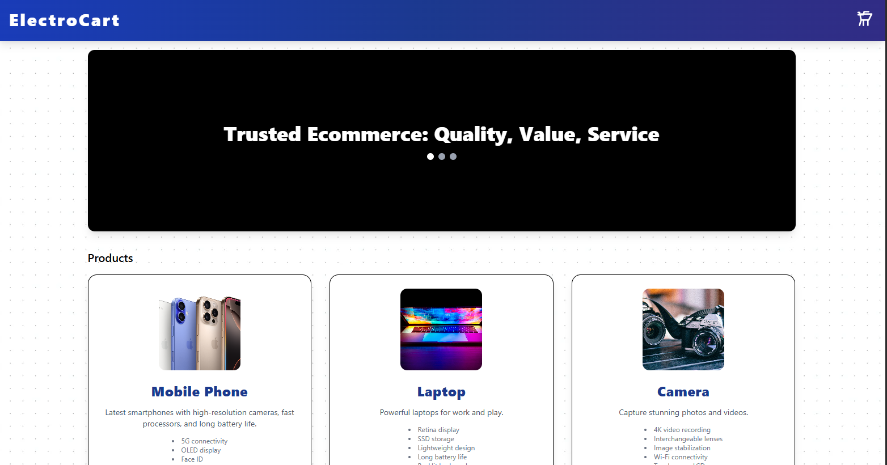

# Shopping Cart

A modern e-commerce shopping cart built with React, Redux, and Vite.

## 🚀 Live Demo

[View on GitHub Pages](https://shkms11.github.io/shopping-cart/)

## 📸 Screenshot



## ✨ Features

-   Product categories with images and features
-   Add/remove items to cart
-   Order confirmation modal
-   Responsive design
-   Deployed on GitHub Pages

## 🛠️ Tech Stack

-   React + Vite
-   Redux Toolkit
-   TypeScript
-   Tailwind CSS

## 🧑‍💻 Installation

```bash
git clone https://github.com/shkms11/shopping-cart.git
cd shopping-cart
npm install
npm run dev
```

## 🚢 Deployment

```bash
npm run deploy
```

See it live at: https://shkms11.github.io/shopping-cart/

## 📄 License

MIT
